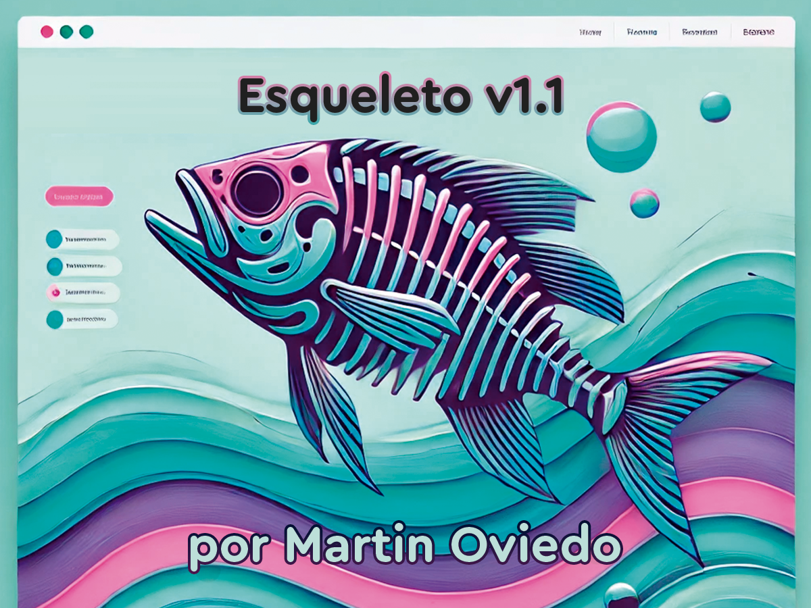

# Esqueleto Theme v1.1.0

Esqueleto Theme es un tema de WordPress minimalista y flexible, diseñado para funcionar sin problemas con Elementor. Ideal para desarrolladores, diseñadores y creativos que buscan un punto de partida sin estilos predeterminados, Esqueleto ofrece la estructura esencial de un tema de WordPress, permitiéndote construir y personalizar desde cero sin distracciones.

## Características

- **Compatibilidad con Elementor**: Preparado para trabajar en conjunto con Elementor, ofreciendo la capacidad de crear diseños personalizados de forma visual.
- **Código Ligero y Eficiente**: Diseñado desde cero para ser rápido y eficiente, sin estilos adicionales que sobrecarguen la página.
- **Sin Estilos Predeterminados**: Este tema no incluye CSS adicional, brindándote un verdadero lienzo en blanco para aplicar tus propios estilos y adaptarlo a tus necesidades.
- **Soporte para Imágenes Modernas**: Compatible con formatos de imagen modernos como WebP y SVG, además de los formatos clásicos.
- **Soporte para Logos Personalizados**: Incluye soporte para subir un logo personalizado desde el personalizador de WordPress.
- **Opciones de Personalización Extensibles**: Aunque minimalista, Esqueleto está preparado para ser extendido y adaptado a cualquier proyecto.

## Requisitos

- **Versión de WordPress**: 5.0 o superior
- **PHP**: 7.4 o superior
- **Elementor**: Se recomienda instalar Elementor para aprovechar al máximo la flexibilidad del tema.

## Instalación

1. Descarga el tema desde [GitHub](#).
2. Ve a tu panel de administración de WordPress y selecciona `Apariencia > Temas`.
3. Haz clic en `Añadir nuevo` y luego en `Subir tema`.
4. Selecciona el archivo ZIP descargado y haz clic en `Instalar ahora`.
5. Activa el tema.

## Uso

Una vez activado, puedes usar Elementor para diseñar tus páginas sin restricciones de estilo. Esqueleto Theme no incluye CSS adicional, lo cual te permite construir desde cero y agregar solo los estilos que necesitas.

## Estructura del Proyecto

- `/css/reset.css` - Archivo de estilo reset para una base limpia de CSS.
- `functions.php` - Funciones esenciales para el soporte del tema y compatibilidad con Elementor.
- `header.php`, `footer.php`, `index.php`, etc. - Plantillas básicas de WordPress.

## Capturas de Pantalla

## Créditos

Creado por [Martín Oviedo](https://github.com/martinoviedo) como un tema base flexible y ligero para WordPress.

## Changelog

### v1.1.0
- Mejoras en la compatibilidad con Elementor.
- Añadido soporte para logos personalizados.
- Añadido soporte para formatos de imagen modernos como WebP y SVG.
- Optimización del código y limpieza de estilos predeterminados.

### v1.0.0
- Versión inicial del tema Esqueleto.
- Integración básica con Elementor.
- Estructura minimalista sin estilos adicionales.

## Licencia

Esqueleto Theme está disponible bajo la licencia MIT. Consulta el archivo `LICENSE` para más detalles.
